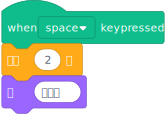
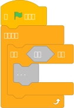
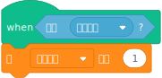
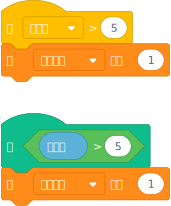
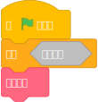
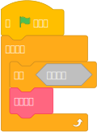
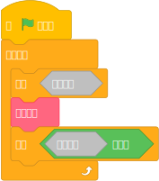
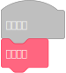
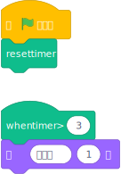

# 事件和帽子积木

import {ExtensionCode, Spoiler} from './utils.js';

事件积木和帽子积木是两种用于控制脚本运行时机的积木类型。尽管它们看起来相似，但本质不同。

## 事件积木

事件积木用于响应外部事件运行脚本。例如“当绿旗被点击”——事件就是用户点击绿旗按钮的那一刻。“当此角色被点击”类似地是响应点击事件而运行的，尽管 Scratch 需要做更多工作来确定事件发生在哪个角色上。事件积木可用于任何允许你运行回调的外部事件。

:::warning
事件积木仅在非沙盒化扩展中支持。
:::

事件积木本身永远不会被执行；它们只是标记哪些脚本应该运行。例如，考虑这个你熟悉的积木：


当你运行这个积木时，它本身不会做任何事情。它只是表示其下方的内容应该被运行。我们可以使用 `Scratch.BlockType.EVENT` 创建自己的具有类似功能的事件积木：

<ExtensionCode title="unsandboxed/when-space-key-pressed">{require("!raw-loader!@site/static/example-extensions/unsandboxed/when-space-key-pressed.js")}</ExtensionCode>

我们稍后会讨论 `isEdgeActivated: false` 的含义，但对于事件积木来说，这是**必需的样板代码**。

在此示例中，我们定义了 opcode `whenSpacePressed`，但是**因为它是事件积木，我们不需要为它编写任何代码。**

要启动事件积木，你需要使用 startHats。有两个版本：

- `Scratch.vm.runtime.startHats` 应该在积木外部使用(例如，点击绿旗)
- `util.startHats` 应该在积木内部使用(例如，广播积木)

:::warning
在积木内部使用 `Scratch.vm.runtime.startHats` 而不是 `util.startHats` 可能会破坏脚本执行。
:::

参数和返回值**完全**相同。传递给 startHats 的第一个参数是*完整的*积木 opcode，即 `extensionid_opcode`。在此示例中为 `eventexampleunsandboxed_whenSpacePressed`。这将启动运行项目中所有顶部积木为此 opcode 的脚本。

在此示例中，我们使用了 keydown 事件，但你可以使用任何你想要的事件。尝试改用 click 事件，或 setTimeout/setInterval、fetch() 等其他 API。只要你能获得回调，这就会起作用。

## 按菜单筛选

你可能会注意到 Scratch 的内置“当按键被按下”积木有一个菜单。使用我们当前的扩展，我们需要为每个键添加一个新积木。这不理想。相反，我们也可以使用菜单。

<ExtensionCode title="unsandboxed/when-key-pressed">{require("!raw-loader!@site/static/example-extensions/unsandboxed/when-key-pressed.js")}</ExtensionCode>

积木的定义与其他积木类似。请注意，事件积木**仅支持字段菜单**。你不能有文本输入或放置积木的地方。要按参数筛选，它**必须是一个 acceptReporters: false 的菜单**。(稍后讨论的积木类型对此更宽松。)

startHats 的第一个参数再次是完整的 opcode。startHats 的第二个参数是一个对象，用于筛选要激活的事件。此对象中的键名是积木的参数名称(在此示例中为 `KEY`)，值对应于菜单的值(不是文本!)。如果你想按多个键筛选，所有键都必须匹配。

Scratch 中真正的“当按键被按下”积木比这个复杂一点。这只是一个例子。

## 按角色筛选

Scratch 的“当此角色被点击”积木只在一个角色上运行，而不是每个角色上。要自己做到这一点，你可以使用 startHats 的第三个(也是最后一个)参数。第三个参数可以设置为目标对象——每个角色或克隆都是一个“目标”。如果设置，只有该目标中的事件积木会运行。

获取目标对象的最常见方法是：

- `Scratch.vm.runtime.getTargetForStage()` 获取舞台目标
- `Scratch.vm.runtime.getSpriteTargetByName("Sprite1")` 获取具有给定名称的非克隆目标
- `Scratch.vm.runtime.targets` 获取完整列表供你自己搜索

在此示例中，我们修改了之前的扩展，使其仅在舞台中运行积木。

<ExtensionCode title="unsandboxed/when-key-pressed-stage">{require("!raw-loader!@site/static/example-extensions/unsandboxed/when-key-pressed-stage.js")}</ExtensionCode>

要仅按角色筛选而不是按字段筛选，可以将第二个参数设置为 null 或空对象 (`{}`)。

## 重新启动现有线程

考虑这个脚本：



你可能会观察到，如果你反复按空格键，脚本不会重新启动(这会重置等待积木计时器)——它只是继续执行。如果这不是你想要的，请在积木上设置 `shouldRestartExistingThreads: true`。

<ExtensionCode title="unsandboxed/when-key-pressed-restart">{require("!raw-loader!@site/static/example-extensions/unsandboxed/when-key-pressed-restart.js")}</ExtensionCode>

如果你重新创建相同的脚本，只要你反复按空格键，说积木将永远不会执行，因为脚本每次都会重新启动，这会重置等待积木计时器。

请注意，如果顶部积木具有 `shouldRestartExistingThreads: true` 的脚本运行时调用 startHats 本身(类似于“当我收到 message1：广播 message1”)，当前运行的脚本将被标记为重新启动，但会继续运行积木直到它产生。

## 启动的线程列表

最后，startHats 返回它启动的 Thread 对象数组。你可以使用它来监控线程状态，确定启动了多少线程等。

<ExtensionCode title="unsandboxed/broadcast-5">{require("!raw-loader!@site/static/example-extensions/unsandboxed/broadcast-5.js")}</ExtensionCode>

## 基于谓词的帽子积木

:::info
基于谓词的帽子仅在非沙盒化扩展中支持。
:::

基于谓词的帽子积木允许你创建类似于以下内容的东西：



基于谓词的帽子基本上是事件积木的更强大版本。它使用相同的 startHats 并支持 `shouldRestartExistingThreads`。除此之外，帽子积木必须定义一个返回 true 或 false 的函数。积木的所有输入都将被评估，然后帽子积木可以使用该信息来确定是否应该运行其下方的积木。积木类型是 `Scratch.BlockType.HAT`。我们可以将上面的内容近似为：

<ExtensionCode title="unsandboxed/when">{require("!raw-loader!@site/static/example-extensions/unsandboxed/when.js")}</ExtensionCode>

你可以这样测试积木：



请注意，这并不完全相同。如果没有视觉变化或项目处于加速模式，永远积木每帧会运行很多次，而帽子积木每帧恰好运行一次。

`isEdgeActivated: false` 再次是必需的样板代码。积木的定义与其他积木相同。startHats 的工作方式与事件积木完全相同：第一个参数是*完整的* opcode，然后是可选的字段筛选，然后是可选的目标筛选。

重要的区别是 `when` 实际上有代码。在你执行 startHats 之后，积木的输入和参数将被评估并传递给积木。积木可以返回 `true` 让脚本运行，或者返回 `false` 阻止它运行。如果需要，积木也可以返回一个解析为 `true` 或 `false` 的 Promise。

这里有一个棘手的事情是 Scratch 不会自动启动基于谓词的帽子积木——你需要自己做。在此示例中，我们使用 `BEFORE_EXECUTE` 事件(顾名思义，它在运行任何脚本之前运行，所以你在这里启动的任何东西都将在该帧中运行)。与事件积木一样，你可以从任何获得回调的地方运行基于谓词的帽子积木。

## 边缘激活的帽子积木

基于谓词的帽子允许你在条件*为*真时运行脚本。边缘激活的帽子积木允许你在条件*变为*真时运行脚本。

这是一个细微但重要的区别。考虑这两个脚本：



虽然积木看起来相似，但它们有很大的不同。顶部的那个只会在计时器*变为* 5 时运行*一次*，而底部的那个会在计时器达到 5 后反复运行。

:::info
边缘激活的帽子可以在任何扩展中使用，甚至是沙盒化的扩展
:::

让我们想想如何使用普通的 Scratch 积木实现这一点。你可以尝试这样：



这只会工作一次。我们怎样才能让它无限次工作?



差不多。边缘激活的帽子等待条件变为 false，然后脚本才能再次运行——如果条件已经为真，它就不能*变为*真。



本质上，边缘激活的帽子让我们将该循环重写为：



为了演示这一点，我们可以编写一个类似于 Scratch 的“当计时器大于”积木的扩展。blockType 再次是 `Scratch.BlockType.HAT`，但这次是 `isEdgeActivated: true`：

<ExtensionCode title="timer-reimplementation">{require("!raw-loader!@site/static/example-extensions/timer-reimplementation.js")}</ExtensionCode>

请注意，我们不必运行 startHats——Scratch 会在每一帧开始时自动为每个边缘激活的帽子运行 startHats。这让你可以在沙盒化扩展中使用边缘激活的帽子。你也不应该为边缘激活的帽子使用 `shouldRestartExistingThreads: true`。

要测试这个，可以使用这样的脚本：



打开 JavaScript 控制台，按绿旗，然后等待几秒钟。你会看到类似这样的内容：

```js
...
2.719 false
2.753 false
2.785 false
2.818 false
2.851 false
2.885 false
2.918 false
2.951 false
2.985 false
3.017 true
4.113 true
4.148 true
4.181 true
4.214 true
4.248 true
4.281 true
4.314 true
4.347 true
4.381 true
...
```

当扩展的计时器达到 3 秒时，积木返回 true，脚本开始运行。日志停止 1 秒，因为脚本正在运行。脚本完成后，帽子积木再次开始运行。由于它仍然返回 true，脚本不会再次运行，因为条件没有*变为*真。

与基于谓词的帽子类似，边缘激活的帽子可以接受任意输入，如果需要，也可以返回 Promise。

## 练习

1. 创建一个每秒钟运行一次的基于事件的积木，另一个每 5 秒运行一次，还有一个每 10 秒运行一次。
2. 将这些事件积木组合成一个带菜单的积木。
3. 创建一个带有文本输入的命令积木，用于运行普通的 Scratch 广播。内置的“当我收到”积木的完整 opcode 是 `event_whenbroadcastreceived`，其唯一参数称为 `BROADCAST_OPTION`，即广播的名称。
4. 修改上一个练习的广播积木，使其成为一个返回值积木，返回一个逗号分隔的列表，包含启动新线程的每个角色的名称。(提示：<Spoiler>每个线程对象包含一个 .target 属性，每个目标对象都有一个 .getName() 方法。</Spoiler>)

## 下一步

我们已经介绍了很多 API，但[如何确保我们所做的更改不会破坏项目?](./compatibility)