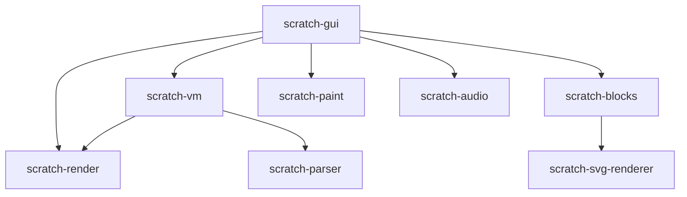

# Bilup GUI 内部架构

本节提供 Bilup GUI 架构、内部系统和组件结构的全面文档。无论您是为 Bilup 贡献代码、构建插件，还是创建自定义修改，本指南都将深入了解一切工作原理。

## 架构概述

Bilup 的 GUI 遵循现代基于 React 的架构，包含几个关键层：

```
┌─────────────────────────────────────────────┐
│                 React App                   │
├─────────────────────────────────────────────┤
│               Redux Store                   │
│         (状态管理)                          │
├─────────────────────────────────────────────┤
│              HOCs & Containers              │
│        (数据流 & 副作用)                     │
├─────────────────────────────────────────────┤
│             React Components               │
│           (UI & 展示)                       │
├─────────────────────────────────────────────┤
│              Addon System                  │
│        (扩展 & 自定义)                      │
├─────────────────────────────────────────────┤
│             Theme Engine                   │
│          (样式 & 主题)                      │
└─────────────────────────────────────────────┘
```

## 核心包

### 主要仓库

- **[scratch-gui](https://github.com/Bilup/scratch-gui)** - 主 GUI 实现
- **[scratch-vm](https://github.com/Bilup/scratch-vm)** - 虚拟机和运行时
- **[scratch-render](https://github.com/Bilup/scratch-render)** - 渲染引擎
- **[scratch-blocks](https://github.com/Bilup/scratch-blocks)** - 可视化积木编辑器
- **[scratch-paint](https://github.com/Bilup/scratch-paint)** - 造型/背景编辑器

### 包依赖关系



## 文件结构

```
scratch-gui/
├── src/
│   ├── components/          # React UI 组件
│   ├── containers/          # Redux 连接的容器
│   ├── lib/                 # 工具库
│   ├── reducers/            # Redux 归约器
│   ├── addons/              # 插件系统
│   ├── css/                 # 全局样式
│   └── index.js             # 入口点
├── static/                  # 静态资源
├── test/                    # 测试文件
└── webpack.config.js        # 构建配置
```

## 关键概念

### 组件层次结构

GUI 遵循清晰的组件层次结构：

1. **App Container** - 根应用包装器
2. **GUI Component** - 主界面布局
3. **Feature Containers** - 积木、舞台、角色等
4. **UI Components** - 按钮、模态框、菜单等
5. **Addon Components** - 增强功能

### 状态管理

Bilup 使用 Redux 进行集中式状态管理：

- **Project State** - 当前项目、加载状态
- **Editor State** - 活动选项卡、选中角色
- **UI State** - 模态框可见性、设置
- **VM State** - 运行时信息
- **Addon State** - 插件配置

### 数据流

```
用户操作 → 组件 → 容器 → Action → 归约器 → Store → 组件
```

### 事件系统

组件通过以下方式通信：

- **Redux Actions** - 状态更改
- **VM Events** - 运行时事件
- **Addon Hooks** - 扩展点
- **DOM Events** - 用户交互

## 主要系统

### [核心组件](/gui-internals/components/gui-component)
包括主 GUI 组件、积木编辑器、舞台和角色管理等基本 UI 构建块。

### [容器与 HOC](/gui-internals/containers/overview)
连接 Redux 的容器和高阶组件，管理数据流和副作用。

### [状态管理](/gui-internals/state/redux-store)
全面的 Redux store 设置、归约器、动作和中间件，用于管理应用状态。

### [插件系统](/gui-internals/addons/home)
强大的扩展系统，允许自定义功能、UI 修改和行为更改。

### [主题与样式](/gui-internals/theming/home)
动态主题系统，支持 CSS 变量、自定义主题和外观定制。

### 性能与优化
性能监控、优化技术和调试工具。

## 开发模式

### 组件设计

Bilup 组件遵循以下模式：

```jsx
// 使用钩子的函数组件
const MyComponent = ({ prop1, prop2 }) => {
    const [state, setState] = useState(initialState);
    
    useEffect(() => {
        // 副作用
    }, [dependencies]);
    
    return (
        <div className={styles.container}>
```

## 开始探索

选择以下主题之一开始深入了解：

- [架构详解](architecture.md) - 深入了解系统架构
- [核心组件](components/gui-component.md) - 主要 UI 组件
- [容器模式](containers/overview.md) - 数据绑定模式
- [状态管理](state/redux-store.md) - Redux 集成
- [插件系统](addons/home.md) - 扩展框架
- [主题系统](theming/home.md) - 样式定制

## 开发模式

### 状态管理模式

```js
// Action 创建器
const updateSetting = (key, value) => ({
    type: 'UPDATE_SETTING',
    key,
    value
});

// 归约器
const settingsReducer = (state = initialState, action) => {
    switch (action.type) {
        case 'UPDATE_SETTING':
            return {
                ...state,
                [action.key]: action.value
            };
        default:
            return state;
    }
};
```

### 插件集成

```js
// 插件 API 使用
export default class MyAddon {
    onEnable() {
        this.addButton();
        this.addCSS();
    }
    
    addButton() {
        const button = document.createElement('button');
        this.addon.tab.appendToSharedSpace({
            space: 'stageHeader',
            element: button,
            order: 1
        });
    }
}
```

## 构建系统

### Webpack 配置

Bilup 使用复杂的 Webpack 设置：

- **开发服务器** - 热重载、source maps
- **生产构建** - 压缩、优化
- **插件处理** - 动态插件加载
- **资源管理** - 图像、字体、CSS

### 关键构建特性

- **代码分割** - 减少包大小
- **Tree Shaking** - 死代码消除
- **热模块替换** - 快速开发
- **CSS 处理** - PostCSS、自动前缀
- **SVG 优化** - 压缩矢量图形

## 测试策略

### 测试类型

1. **单元测试** - 单个组件测试
2. **集成测试** - 组件交互测试
3. **端到端测试** - 完整用户工作流程测试
4. **性能测试** - 渲染和运行时性能

### 测试工具

- **Jest** - 测试运行器和断言
- **React Testing Library** - 组件测试
- **Puppeteer** - E2E 测试
- **Lighthouse** - 性能审计

## 调试工具

### 内置调试

- **Redux DevTools** - 状态检查
- **React DevTools** - 组件树检查
- **性能分析器** - 运行时性能分析
- **插件开发者工具** - 插件调试工具

### 开发辅助函数

```js
// 调试工具
window.vm // 访问 VM 实例
window.reduxStore // 访问 Redux store
window.scratchGui // GUI 工具
window.addons // 插件系统访问
```

## 贡献指南

### 代码标准

- **ESLint** - 代码质量强制执行
- **Prettier** - 代码格式化
- **JSDoc** - 文档注释
- **PropTypes** - 组件属性验证

### Git 工作流程

1. **分叉仓库**
2. **创建功能分支**
3. **进行更改并测试**
4. **提交拉取请求**
5. **通过 CI 检查**
6. **代码审核流程**

## 内部开发入门

### 插件开发者
从 [插件系统概述](/gui-internals/addons/home) 开始，了解如何扩展 Bilup 的功能。

### 贡献者
从 [架构指南](/gui-internals/architecture) 开始，了解整体系统设计。

### 主题开发者
探索 [主题系统](/gui-internals/theming/home) 了解自定义 Bilup 外观的方法。

### 性能工程师
学习优化技术和监控工具以提高 Bilup 性能。

---

*本文档会随着 Bilup 的发展而持续更新。要获取最新信息，请始终参考源代码和 Git 历史。*