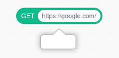

# CORS：为什么你的 Fetch 积木不工作

任何使用过 Fetch、HTTP、Network 及类似扩展的人都注意到，当你尝试获取某些网站时，即使在点击「允许」之后，积木仍然不工作：

原因被称为 **CORS**，这是一种限制网站交互方式的安全功能。

## 什么是 CORS？{#cors}

它是跨域资源共享(Cross-Origin Resource Sharing)的缩写，但我们不打算深入探讨其 [内部细节](https://developer.mozilla.org/en-US/docs/Glossary/CORS)——其他地方已经这样做了。CORS 解决的核心问题很容易理解：

 - 一些网站想要**阻止**来自其他网站的访问
 - 其他网站想要**允许**来自其他网站的访问

想象一下，如果你访问的任何网站都能代表你访问你的银行网站，那将相当糟糕！但有时候这种访问不是问题，而且实际上是预期的。Scratch API 的某些部分启用了 CORS，这就是 Bilup 如何从 Scratch 加载项目的方式。

CORS 是网站声明是否希望其他网站能够访问它们的方式。默认情况下，不允许访问。网站必须**选择加入 CORS**，这允许其他网站访问它们。如果网站没有选择加入，你的浏览器会向 Bilup 提供一个非常通用的「网络错误」。

## 如何修复你的积木 {#workarounds}

这取决于 URL 是什么。

 - **切换到不同的 URL：** 如果 URL 只是用于托管静态文件，请找到另一个支持直接下载和 CORS 的主机。如果一个 API 不支持 CORS，请检查竞争对手的 API 是否支持。
 - **使用 CORS 代理：** 你可以请另一台服务器(称为 CORS 代理)代表你访问该网站，然后发回响应，但允许 CORS，而不是让你的浏览器直接访问网站。有很多你可以找到的公共 CORS 代理，但它们寿命通常很短，因为运营成本昂贵且容易被滥用。Bilup 目前不运行自己的 CORS 代理。
 - **切换到 Bilup 桌面版：** 桌面应用有绕过 CORS 的选项。请参阅下文。

## 桌面应用 {#desktop}

在 [Bilup 桌面版](https://desktop.bilup.org/) 中，有一个绕过 CORS 以允许访问任何网站的选项。出于安全原因，它默认是禁用的，以匹配普通网页浏览器。打开如下图位置的桌面设置(也可以在右上角的 ? 按钮下找到)：

import settingsMenu from './assets/desktop-settings.png';

当桌面设置窗口打开时，勾选「允许扩展访问任何网站」旁边的复选框。

## 打包的项目 {#packaged-projects}

在浏览器中运行的项目与任何其他网站受到相同的限制。

打包为 Electron 应用的项目默认绕过 CORS，类似于桌面应用中的选项。

## 如果你正在运行服务器 {#servers}

如果你希望网站能够访问你的网站，请在每个你想公开的响应中设置 `Access-Control-Allow-Origin` 头为 `*`。如果你搜索你使用的网络服务器或框架的名称，然后加上「cors」，你应该能找到很多例子。
