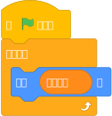

# TurboWarp 如何以 10-100 倍的速度运行 Scratch 项目

:::note
由于 Bilup **基于** TurboWarp，它支持以下所有相同的功能。

:::

TurboWarp 使用*编译器*，而 Scratch 使用*解释器*。这允许 TurboWarp 根据项目以 10-100 倍的速度运行，但它使实时脚本编辑变得 [不可行](#live-script-editing)。

export const Test = ({name, id, scratch, tw}) => (
  <tr>
    <td><a href={`https://scratch.mit.edu/projects/${id}/`}>{name}</a></td>
    <td>{scratch}</td>
    <td>{tw}</td>
  </tr>
);

<table style={{textAlign: "center"}}>
  <thead>
    <tr>
      <th>测试</th>
      <th>Scratch</th>
      <th>TurboWarp</th>
    </tr>
  </thead>
  <tbody>
    <Test name="快速排序 200000 项" id="310372816" scratch="10.746s" tw="0.0528s" />
    <Test name=" Cycles Raytracer r=1 s=10 dof=.08" id="412737809" scratch="832s" tw="16s" />
  </tbody>
</table>

(在 Linux 上的 Chromium 103 中测试)

考虑以下脚本：



Scratch 的解释器在运行时遍历 [抽象语法树](https://en.wikipedia.org/wiki/Abstract_syntax_tree)。在内部，它看起来像这样：

```json
{
  "va[U{Cbi_NZpSOSx_kVA": {
    "opcode": "event_whenflagclicked",
    "inputs": {},
    "fields": {},
    "next": "tzXnZ{8G!xK|t^WAWF{m",
    "topLevel": true
  },
  "tzXnZ{8G!xK|t^WAWF{m": {
    "opcode": "control_forever",
    "inputs": {
      "SUBSTACK": {
        "name": "SUBSTACK",
        "block": "$xf$bq|xl(}RhT-K,taS"
      }
    },
    "fields": {},
    "next": null,
    "topLevel": false
  },
  "$xf$bq|xl(}RhT-K,taS": {
    "opcode": "motion_movesteps",
    "inputs": {
      "STEPS": {
        "name": "STEPS",
        "block": "cw__.I:g}Y~`:5KmO00q"
      }
    },
    "fields": {},
    "next": null,
    "topLevel": false
  },
  "cw__.I:g}Y~`:5KmO00q": {
    "opcode": "data_variable",
    "inputs": {},
    "fields": {
      "VARIABLE": {
        "name": "VARIABLE",
        "id": "`jEk@4|i[#Fk?(8x)AV.-my variable"
      }
    },
    "next": null,
    "topLevel": false
  }
}
```

每当 Scratch 执行任何积木时，它必须做很多工作：

 - 它必须使用其 ID 查找积木，以及该积木的 opcode 对应的函数。
 - 如果积木有输入项，这些也是积木，必须像任何其他积木一样经历相同的步骤，更深处的输入项也是如此。
 - 它手动维护一个积木、循环、条件、过程等的堆栈。
 - Scratch 脚本可以产生(yield)，所以所有这些都必须以可以暂停和稍后恢复的方式发生。
 - Scratch 脚本可以在运行时更改，所以提前缓存所有内容很困难。
 - 另外，即使只执行单个积木，Scratch 中也有*很多*事情在发生。

解释器消耗是在 JavaScript 本身的消耗之上增加的。由于此代码涉及许多动态类型，JavaScript JIT 可能难以优化它。

TurboWarp 的编译器通过将脚本直接转换为 JavaScript 函数来消除所有这些消耗。例如，上述脚本变成：

```javascript
const myVariable = stage.variables["`jEk@4|i[#Fk?(8x)AV.-my variable"];
return function* () {
  while (true) {
    runtime.ext_scratch3_motion._moveSteps((+myVariable.value || 0), target);
    yield;
  }
};
```

需要注意的事项：

 - 不再需要查找积木 ID 或 opcode：它只是 JavaScript。
 - 不再需要手动查找输入项：它们只是 JavaScript 参数。
 - 不再需要手动维护状态：它只是 JavaScript。
 - 由于这是一个单一的 JavaScript 函数，我们无法轻松实现 [实时脚本编辑](#live-script-editing)
 - 如果 JavaScript JIT 注意到某个变量始终是数字，它理论上可以相应地进行优化。
 - 与典型的人类编写的 JavaScript 相比，这个 JavaScript 看起来非常奇怪，并且由于我们保持与边缘情况 Scratch 行为的兼容性而运行得更慢。
 - 我们手动格式化了 JavaScript 并重命名了一些变量以使其更具可读性。真实的代码使用像 `b0` 这样的变量名，没有格式化。

当然，这是一个非常简单的脚本，解释器消耗可以忽略不计，对于大多数项目来说也是如此。只有当你每帧执行数千个积木时，解释器的消耗才会变得显著。

这是一个更复杂的例子：一个简单的排序算法(冒泡排序)。

```javascript
const length = stage.variables["O;aH~(njYNn}Bl@}!%pS-length-"];
const list = stage.variables["O;aH~(njYNn}Bl@}!%pS-list-list"];
const newLength = stage.variables["O;aH~(njYNn}Bl@}!%pS-new-"];
const i = stage.variables["O;aH~(njYNn}Bl@}!%pS-i-"];
const temp = stage.variables["O;aH~(njYNn}Bl@}!%pS-tmp-"];
return function fun1_sort () {
  length.value = list.value.length;
  // 重复直到 length = 0
  while (!compareEqual(length.value, 0)) {
    newLength.value = 0;
    i.value = 1;
    // 重复 length - 1 次
    for (var counter = ((+length.value || 0) - 1) || 0; counter >= 0.5; counter--) {
      // 将 i 改变 1
      i.value = ((+i.value || 0) + 1);
      // 如果列表的第 i-1 项大于列表的第 i 项
      if (
        compareGreaterThan(
          list.value[((((i.value || 0) - 1) || 0) | 0) - 1] ?? "",
          list.value[((i.value || 0) | 0) - 1] ?? ""
        )
      ) {
        // 交换列表的第 i 项和第 i-1 项
        temp.value = listGet(list.value, i.value);
        listReplace(
          list,
          i.value,
          list.value[((((+i.value || 0) - 1) || 0) | 0) - 1] ?? ""
        );
        listReplace(
          list,
          (+i.value || 0) - 1,
          temp.value
        );
        newLength.value = i.value;
      }
    }
    length.value = newLength.value;
  }
};
```

### 实时脚本编辑 {#live-script-editing}

如果你使用编译器启动脚本，你将无法移动、删除或添加积木并像在 Scratch 中那样实时反映更改。必须重新启动脚本才能应用更改。我们相信有一些方法可以实现这一点，但它们会损害性能或增加显著的复杂性。这是我们最终想要实现的事情，但目前还没有。
