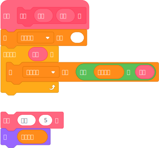
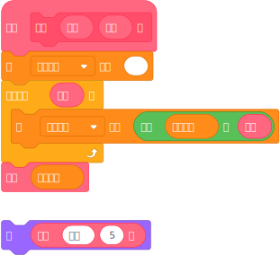
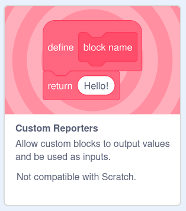
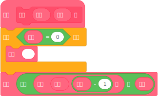
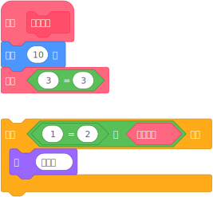

# 自定义返回值

<!-- :::note
由于 Bilup **基于** TurboWarp，它支持以下所有相同的功能。

::: -->

Bilup 现在支持自定义返回值，它允许你使用项目中的任何自定义积木作为返回值，就像 Scratch 内置的加法积木一样。这是文本编程语言中相当标准的功能，但一开始可能很难理解。

:::info
使用此功能的项目无法上传到 Scratch 网站。
:::

从技术上讲，自定义返回值并不能让你做任何以前做不到的事情——它们只是让阅读和编写变得*更加*容易。例如，如果你的项目需要经常重复文本，你可能会写出这样的脚本：

<!-- 对不起使用了位图，scratchblocks 在我制作这些时坏了 https://github.com/scratchblocks/scratchblocks/issues/486 -->

这可以工作，但它相当丑陋，随着你更多地使用这个积木，情况只会变得更糟。使用 返回 积木创建自定义返回值，这变得简单得多：

## 如何使用 {#usage}

<!-- 通过点击编辑器左下角的按钮打开扩展库（与找到「画笔」等东西的位置相同），然后启用「自定义返回值」：

 -->
此功能在 Bilup 中自动启用，无法通过常规方式禁用。

像平常一样创建一个自定义积木。要制作自定义返回值，只需将「返回」积木拖到脚本中——它位于自定义积木列表的底部。你不需要勾选任何复选框或切换任何东西。

一旦遇到 返回 积木，它的功能类似于「停止这个脚本」。

Bilup 会自动重塑积木的形状，猜测正确的形状，但有时会猜错。你可以通过右键点击积木然后选择「更改为堆叠积木」或「更改为返回值」来更改积木的形状。

类似地，如果自定义积木中的所有 返回 积木都包含布尔值（真/假），如「1 > 2」，那么自定义积木也将具有布尔形状。这只是一个视觉辅助，因为任何自定义返回值都可以放入任何输入中。

## 递归 {#recursion}

也支持递归。这可能特别难掌握，但基本上，积木可以运行它们自己。如果你能够将一个大问题不断分解成更小的问题，直到达到一个已知的「基本情况」，许多算法可以写得非常优雅。

使用递归，你可以重写 repeat 积木，完全不使用变量：

就像自定义返回值本身一样，递归并不能让你做任何技术上以前做不到的事情，但它可以让理解变得容易得多。（任何用循环编写的东西都可以用递归重写。任何用递归编写的东西都可以用循环重写。有时候一种解决方案比另一种更容易。）

:::info
使用编译器时，请注意过多的递归可能导致 [栈溢出错误](https://en.wikipedia.org/wiki/Stack_overflow)。递归超过几千层深度通常会抛出错误。
:::

## 编译器和解释器之间的差异 {#interpreter-compiler}

解释器支持无限递归，而编译器受 JavaScript 堆栈大小限制，通常约为几千调用深度，但因系统和浏览器而异。

:::info
建议确保自定义返回值只运行某些算法并输出最终答案。为了确保你的项目在编译器和解释器中运行相同，自定义返回值应避免移动角色、说话、等待等行为。
:::

为了提高性能，编译器有一个称为 [短路求值](https://en.wikipedia.org/wiki/Short-circuit_evaluation) 的功能。想象一个 Scratch 积木如 `(1 = 2) 与 (3 = 3)`。当编译器看到这个积木时，它首先计算「1 = 2」，这显然是假的。在这种情况下，编译器甚至不需要检查「与」积木的另一侧，因为这无关紧要：最终结果始终为假。通常这只是免费获得的性能，但如果你的积木有副作用（如移动角色），则会出现不同的行为，因为解释器始终计算所有积木。尝试这个脚本来看看：

如果你有多个自定义返回值深深嵌套在其他积木中，它们运行的顺序在编译器和解释器之间可能会有所不同。
