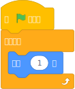

# 60 FPS(自定义 FPS)

自定义 FPS(每秒帧数)更改脚本每秒运行的频率。最常见的是更改为 60 FPS，但可以设置 1 到 500 之间的任何值。

值为 0 是特殊的：它将使项目以与屏幕相同的帧率运行，而不是固定间隔。这也意味着当项目的标签页被隐藏时，项目的脚本可能会停止运行。

绝大多数项目在使用自定义帧率时无法正常工作。对于这些项目，应该改用 [插值](interpolation)。例如，考虑以下简单脚本：

在 30 FPS(Scratch 通常的帧率)下运行时，此脚本每秒运行 30 次，因此角色每秒移动 30 步。但是，如果帧率更改为 60，脚本将每秒运行 60 次，因此角色每秒将移动两倍的步数。

要创建与自定义帧率兼容的项目，您应该使用增量时间等技术：

- https://en.wikipedia.org/wiki/Delta_timing
- https://scratch.mit.edu/projects/487694716/ (Scratch 示例)

这些技术可能需要对您的项目进行重大更改。