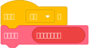

# TurboWarp 积木

:::note
「TurboWarp 积木」在 Bilup 中被命名为「Bilup 积木」。

「is TurboWarp?」积木已被修改为「is Bilup?」。

原始积木「is TurboWarp?」不会返回 true，因为它是 Bilup，不是 TurboWarp。

:::

TurboWarp 有一系列积木，允许你使用以前 Scratch 项目无法访问的某些功能。

新功能：TurboWarp 现在支持非沙盒化扩展，它们添加了新的积木！https://extensions.turbowarp.org/

## is compiled? 和 is TurboWarp? {#is-compiled}

请参阅 https://scratch.mit.edu/projects/414716080/

这些积木与 Scratch「兼容」，因为它们实际上只是修改过的参数报告器。

:::warning
此警告之后的每个积木都与 Scratch **不兼容**。使用它们的项目**无法**上传到 Scratch 网站。如果你不使用任何 TurboWarp 独占积木，那么在 TurboWarp 中制作项目并上传到 Scratch 应该没有问题。
:::

## 上次按下的键 {#last-key-pressed}

它告诉你最后一次按下的键。它的预期用途是这样的：

## 鼠标按钮是否按下？{#mouse-button-down}

它类似于「鼠标是否按下？」但允许你检查每个单独的按钮。请记住，由于 Scratch 解释鼠标输入的方式，像「主要鼠标按钮是否按下？」这样的积木可能报告 true，而标准的「鼠标是否按下？」可能报告 false。

 * (0) 主要按钮通常是左键
 * (1) 中间按钮通常是滚轮
 * (2) 次要按钮通常是右键（运行此积木一次将禁用舞台上的右键菜单）
